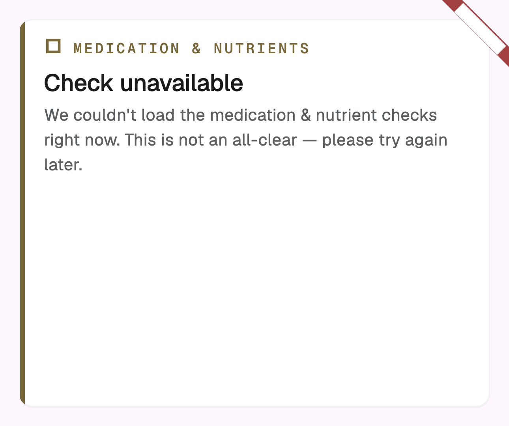

# B1 pharmacist review packet

Status: **licensed pharmacist clinical review complete**

Scope: **31 consumer-visible records** after **33 reviewed records**. The 49 suppressed/rejected records are intentionally not consumer-facing.

Artifact: schema `5.4.0`, content version `2026-07-27`, content hash `sha256:180a7380a03f20066103030d496124ee9a5e1c8e65167da095b627ace36f7f98`.

## Review focus

**Approval covers the full card copy shown to the user — all eight consumer-visible fields reproduced under each record below, not only mechanism, clinical impact, and recommendation.** Every line printed under "Consumer-visible card copy" is text a user can read in the app.

- Confirm the medication scope and nutrient relationship are clinically accurate.
- Confirm the mechanism and clinical impact are supported by the linked evidence.
- Confirm recommendations are calm, actionable, and do not imply universal supplementation.
- Confirm monitoring and supplement-interaction records are not presented as measured deficiency.
- Dispositions are limited to `approved`, `approved_with_wording_change`, `requires_evidence_revision`, or `remove_from_release`.

## App presentation

**These images are layout-regression artifacts, not clinical-review evidence.** They are Flutter golden files: text renders as filled boxes because no font is registered in the test binding, and the verified card is captured in its collapsed state, so the expanded detail copy does not appear. Review the card copy from the per-record text below, which is the authoritative source. Do not base an approval on these screenshots.

Verified records (layout only):

Unavailable analysis, explicitly not an all-clear (layout only):

## Review disposition index

| Record | Medication / class | Nutrient | Relationship | Disposition | Consumer-visible |
|---|---|---|---|---|---|
| `DEP_ANTACIDS_IRON` | Acid reducers (PPIs and H2 blockers) (`class:acid_suppressants`) | Iron | `depletion` | `approved_with_wording_change` | yes |
| `DEP_ANTICONVULSANTS_VITAMIND` | Carbamazepine (`2002`) | Vitamin D | `depletion` | `approved` | yes |
| `DEP_CHOLESTYRAMINE_VITAMINA` | Cholestyramine (bile-acid sequestrant) (`2447`) | Vitamin A | `depletion` | `approved` | yes |
| `DEP_CHOLESTYRAMINE_VITAMIND` | Cholestyramine (bile-acid sequestrant) (`2447`) | Vitamin D | `depletion` | `approved` | yes |
| `DEP_CHOLESTYRAMINE_VITAMINE` | Cholestyramine (bile-acid sequestrant) (`2447`) | Vitamin E | `depletion` | `approved` | yes |
| `DEP_CHOLESTYRAMINE_VITAMINK` | Cholestyramine (bile-acid sequestrant) (`2447`) | Vitamin K | `depletion` | `approved` | yes |
| `DEP_COLCHICINE_VITAMINB12` | Colchicine (gout medication) (`2683`) | Vitamin B12 | `depletion` | `approved_with_wording_change` | yes |
| `DEP_ANTICONVULSANTS_CALCIUM` | Enzyme-inducing antiseizure medications (`class:enzyme_inducing_antiseizure_medications`) | Calcium | `depletion` | `approved` | yes |
| `DEP_ANTICONVULSANTS_VITAMINK` | Enzyme-inducing antiseizure medications (`class:enzyme_inducing_antiseizure_medications`) | Vitamin K | `depletion` | `remove_from_release` | no |
| `DEP_DIURETICS_THIAMINE` | Furosemide (Lasix) (`4603`) | Thiamin | `depletion` | `approved_with_wording_change` | yes |
| `DEP_ISONIAZID_VITAMINB6` | Isoniazid (tuberculosis medication) (`6038`) | Vitamin B6 | `depletion` | `approved` | yes |
| `DEP_LEVOTHYROXINE_CALCIUM` | Levothyroxine (thyroid hormone replacement) (`10582`) | Calcium | `supplement_interaction` | `approved_with_wording_change` | yes |
| `DEP_LEVOTHYROXINE_IRON` | Levothyroxine (thyroid hormone replacement) (`10582`) | Iron | `supplement_interaction` | `approved` | yes |
| `DEP_CORTICOSTEROIDS_CALCIUM` | Long-term oral prednisone (`8640`) | Calcium | `depletion` | `approved_with_wording_change` | yes |
| `DEP_CORTICOSTEROIDS_VITAMIND` | Long-term oral prednisone (`8640`) | Vitamin D | `monitoring_stability` | `approved_with_wording_change` | yes |
| `DEP_DIURETICS_CALCIUM` | Loop diuretics (water pills like furosemide) (`class:loop_diuretics`) | Calcium | `depletion` | `approved` | yes |
| `DEP_METFORMIN_VITAMINB12` | Metformin (type 2 diabetes medication) (`6809`) | Vitamin B12 | `depletion` | `approved_with_wording_change` | yes |
| `DEP_METHOTREXATE_FOLATE` | Methotrexate (antifolate medication) (`6851`) | Folate | `functional_antagonism` | `approved_with_wording_change` | yes |
| `DEP_OCP_VITAMINB6` | Oral contraceptives (birth control pills) (`class:oral_contraceptives`) | Vitamin B6 | `depletion` | `requires_evidence_revision` | no |
| `DEP_ORLISTAT_VITAMINA` | Orlistat (fat-blocking weight-loss medication) (`37925`) | Vitamin A | `depletion` | `approved` | yes |
| `DEP_ORLISTAT_VITAMIND` | Orlistat (fat-blocking weight-loss medication) (`37925`) | Vitamin D | `depletion` | `approved` | yes |
| `DEP_ORLISTAT_VITAMINE` | Orlistat (fat-blocking weight-loss medication) (`37925`) | Vitamin E | `depletion` | `approved` | yes |
| `DEP_ORLISTAT_VITAMINK` | Orlistat (fat-blocking weight-loss medication) (`37925`) | Vitamin K | `depletion` | `approved` | yes |
| `DEP_ANTICONVULSANTS_FOLATE` | Phenytoin (`8183`) | Folate | `depletion` | `approved` | yes |
| `DEP_ANTICONVULSANTS_VITAMINB12` | Phenytoin (`8183`) | Vitamin B12 | `depletion` | `approved` | yes |
| `DEP_ANTACIDS_CALCIUM` | Proton pump inhibitors (PPIs) (`class:proton_pump_inhibitors`) | Calcium | `monitoring_stability` | `approved_with_wording_change` | yes |
| `DEP_SSRIS_SODIUM` | SSRIs (antidepressants) (`class:ssris`) | Sodium | `monitoring_stability` | `approved_with_wording_change` | yes |
| `DEP_STATINS_COQ10` | Statins (cholesterol-lowering medications) (`class:statins`) | Coenzyme Q10 | `depletion` | `approved` | yes |
| `DEP_SULFASALAZINE_FOLATE` | Sulfasalazine (inflammatory bowel disease / arthritis medication) (`9524`) | Folate | `depletion` | `approved` | yes |
| `DEP_DIURETICS_ZINC` | Thiazide diuretics (e.g., hydrochlorothiazide) (`class:thiazide_diuretics`) | Zinc | `depletion` | `approved_with_wording_change` | yes |
| `DEP_DIURETICS_FOLATE` | Triamterene (in Dyazide, Maxzide) (`10763`) | Folate | `functional_antagonism` | `approved` | yes |
| `DEP_ANTICONVULSANTS_LCARNITINE` | Valproate (valproic acid, divalproex / Depakote) (`class:valproate`) | L-Carnitine | `depletion` | `approved_with_wording_change` | yes |
| `DEP_ANTICOAGULANTS_VITAMINK` | Warfarin (anticoagulant / blood thinner) (`11289`) | Vitamin K | `functional_antagonism` | `approved_with_wording_change` | yes |

## Record details

### 1. `DEP_ANTACIDS_IRON`

- Medication / class: Acid reducers (PPIs and H2 blockers) (`class:acid_suppressants`)
- Nutrient: Iron (`iron`)
- Relationship: `depletion`; severity `moderate`; onset `years`

Consumer-visible card copy (every line below is shown to the user — approval covers all of it):

- Headline (`alert_headline`): Long-term acid suppression can affect iron status
- Body (`alert_body`): PPI or H2-blocker use for two years or longer is associated with a higher chance of iron deficiency, especially at higher doses.
- Monitoring tip (`monitoring_tip_short`): Discuss ferritin and blood-count testing if long-term use coincides with symptoms or other iron-deficiency risks.
- What can happen (`clinical_impact`): Use for two years or longer is associated with a higher risk of iron deficiency, with greater risk at higher doses and longer duration. Other causes of iron deficiency still need clinical evaluation.
- From food (`food_sources_short`): Food sources of iron include red meat, poultry, seafood, beans, lentils, tofu, spinach, and fortified cereals.
- Why (`mechanism`): Gastric acid reduces dietary non-heme iron (Fe3+) to the absorbable ferrous form (Fe2+) and frees iron from food. Both PPIs and H2 blockers suppress acid, so long-term use can lower non-heme iron absorption; the effect is dose-related and reverses after stopping.
- Clinical guidance (`recommendation`): If you use a PPI or H2 blocker long term and have iron-deficiency symptoms or risk factors, ask your clinician whether ferritin and blood-count testing is appropriate. Do not start iron without confirming the cause and a suitable treatment plan.
- If already supplementing (`acknowledgement_note`): You're taking iron — a thoughtful step while using acid-reducing medication long-term.

- Evidence: [Lam JR et al. Proton pump inhibitor and histamine-2 receptor antagonist use and iron deficiency. Gastroenterology. 2017](https://pubmed.ncbi.nlm.nih.gov/27890768/); [Hutchinson C et al. Proton pump inhibitors suppress absorption of dietary non-haem iron in hereditary haemochromatosis. Gut. 2007](https://pubmed.ncbi.nlm.nih.gov/17344278/)

Reviewer disposition: **`approved_with_wording_change`**
Review note: Aligned onset and monitoring advice with the >=2-year clinical evidence; removed unsupported dose-separation advice.
Consumer-visible after review: **yes**

Reviewer comment (Approved / Approved with wording change / Requires evidence revision / Remove from release, plus any required change): _______________________________________

### 2. `DEP_ANTICONVULSANTS_VITAMIND`

- Medication / class: Carbamazepine (`drug:2002`)
- Nutrient: Vitamin D (`vitamin_d`)
- Relationship: `depletion`; severity `significant`; onset `months`

Consumer-visible card copy (every line below is shown to the user — approval covers all of it):

- Headline (`alert_headline`): Carbamazepine may lower vitamin D over time
- Body (`alert_body`): Long-term carbamazepine use has been associated with lower vitamin D levels. Your clinician can help decide whether testing or treatment is needed.
- Monitoring tip (`monitoring_tip_short`): Ask whether vitamin D testing fits your treatment plan.
- What can happen (`clinical_impact`): Lower vitamin D can contribute to poorer bone health over time. Individual fracture risk and treatment decisions need clinical assessment.
- From food (`food_sources_short`): Food sources of vitamin D include fatty fish, egg yolks, fortified milk and plant milks, and fortified cereals.
- Why (`mechanism`): Long-term carbamazepine treatment is associated with lower circulating 25-hydroxyvitamin D. Carbamazepine is an enzyme-inducing antiseizure medication; this record does not generalize that result to every antiseizure medicine.
- Clinical guidance (`recommendation`): Discuss vitamin D intake and whether testing is appropriate with the clinician managing carbamazepine. Do not start high-dose vitamin D without individualized advice.
- If already supplementing (`acknowledgement_note`): Vitamin D intake is one part of bone-health planning during long-term carbamazepine therapy.

- Evidence: [Impact of carbamazepine on vitamin D levels: A meta-analysis. Epilepsy Res. 2021.](https://pubmed.ncbi.nlm.nih.gov/34847425/)

Reviewer disposition: **`approved`**
Review note: Carbamazepine-specific meta-analysis supports the bounded claim.
Consumer-visible after review: **yes**

Reviewer comment (Approved / Approved with wording change / Requires evidence revision / Remove from release, plus any required change): _______________________________________

### 3. `DEP_CHOLESTYRAMINE_VITAMINA`

- Medication / class: Cholestyramine (bile-acid sequestrant) (`drug:2447`)
- Nutrient: Vitamin A (`vitamin_a`)
- Relationship: `depletion`; severity `moderate`; onset `months`

Consumer-visible card copy (every line below is shown to the user — approval covers all of it):

- Headline (`alert_headline`): May lower vitamin A absorption
- Body (`alert_body`): Cholestyramine can gradually reduce absorption of Vitamin A over months because this vitamin depends on fat and bile for uptake. Timing vitamins apart can help.
- Monitoring tip (`monitoring_tip_short`): Consider taking vitamins several hours apart from cholestyramine; confirm timing with your clinician.
- What can happen (`clinical_impact`): Lower Vitamin A absorption can matter during long-term cholestyramine use, especially when diet is marginal, fat absorption is already impaired, or pregnancy/nutrition needs are higher.
- From food (`food_sources_short`): _(not set)_
- Why (`mechanism`): Cholestyramine binds bile acids in the gut and can interfere with fat digestion and absorption. Because Vitamin A is fat-soluble, long-term bile-acid binding can reduce absorption unless vitamin timing is managed.
- Clinical guidance (`recommendation`): Review fat-soluble vitamin intake and timing with the prescriber. Vitamins are often separated from cholestyramine so binding in the gut is less likely.
- If already supplementing (`acknowledgement_note`): Good — vitamin A intake helps cover the fat-soluble vitamin gap during cholestyramine use.

- Evidence: [DailyMed — CHOLESTYRAMINE prescribing information](https://dailymed.nlm.nih.gov/dailymed/drugInfo.cfm?setid=09420793-7357-4194-8172-0b1cddb167fe)

Reviewer disposition: **`approved`**
Review note: Current prescribing information supports reduced fat-soluble vitamin absorption.
Consumer-visible after review: **yes**

Reviewer comment (Approved / Approved with wording change / Requires evidence revision / Remove from release, plus any required change): _______________________________________

### 4. `DEP_CHOLESTYRAMINE_VITAMIND`

- Medication / class: Cholestyramine (bile-acid sequestrant) (`drug:2447`)
- Nutrient: Vitamin D (`vitamin_d`)
- Relationship: `depletion`; severity `moderate`; onset `months`

Consumer-visible card copy (every line below is shown to the user — approval covers all of it):

- Headline (`alert_headline`): May lower vitamin D absorption
- Body (`alert_body`): Cholestyramine can gradually reduce absorption of Vitamin D over months because this vitamin depends on fat and bile for uptake. Timing vitamins apart can help.
- Monitoring tip (`monitoring_tip_short`): Consider taking vitamins several hours apart from cholestyramine; confirm timing with your clinician.
- What can happen (`clinical_impact`): Lower Vitamin D absorption can matter during long-term cholestyramine use, especially when diet is marginal, fat absorption is already impaired, or pregnancy/nutrition needs are higher.
- From food (`food_sources_short`): _(not set)_
- Why (`mechanism`): Cholestyramine binds bile acids in the gut and can interfere with fat digestion and absorption. Because Vitamin D is fat-soluble, long-term bile-acid binding can reduce absorption unless vitamin timing is managed.
- Clinical guidance (`recommendation`): Review fat-soluble vitamin intake and timing with the prescriber. Vitamins are often separated from cholestyramine so binding in the gut is less likely.
- If already supplementing (`acknowledgement_note`): Good — vitamin D intake helps cover the fat-soluble vitamin gap during cholestyramine use.

- Evidence: [DailyMed — CHOLESTYRAMINE prescribing information](https://dailymed.nlm.nih.gov/dailymed/drugInfo.cfm?setid=09420793-7357-4194-8172-0b1cddb167fe)

Reviewer disposition: **`approved`**
Review note: Current prescribing information supports reduced fat-soluble vitamin absorption.
Consumer-visible after review: **yes**

Reviewer comment (Approved / Approved with wording change / Requires evidence revision / Remove from release, plus any required change): _______________________________________

### 5. `DEP_CHOLESTYRAMINE_VITAMINE`

- Medication / class: Cholestyramine (bile-acid sequestrant) (`drug:2447`)
- Nutrient: Vitamin E (`vitamin_e`)
- Relationship: `depletion`; severity `moderate`; onset `months`

Consumer-visible card copy (every line below is shown to the user — approval covers all of it):

- Headline (`alert_headline`): May lower vitamin E absorption
- Body (`alert_body`): Cholestyramine can gradually reduce absorption of Vitamin E over months because this vitamin depends on fat and bile for uptake. Timing vitamins apart can help.
- Monitoring tip (`monitoring_tip_short`): Consider taking vitamins several hours apart from cholestyramine; confirm timing with your clinician.
- What can happen (`clinical_impact`): Lower Vitamin E absorption can matter during long-term cholestyramine use, especially when diet is marginal, fat absorption is already impaired, or pregnancy/nutrition needs are higher.
- From food (`food_sources_short`): _(not set)_
- Why (`mechanism`): Cholestyramine binds bile acids in the gut and can interfere with fat digestion and absorption. Because Vitamin E is fat-soluble, long-term bile-acid binding can reduce absorption unless vitamin timing is managed.
- Clinical guidance (`recommendation`): Review fat-soluble vitamin intake and timing with the prescriber. Vitamins are often separated from cholestyramine so binding in the gut is less likely.
- If already supplementing (`acknowledgement_note`): Good — vitamin E intake helps cover the fat-soluble vitamin gap during cholestyramine use.

- Evidence: [DailyMed — CHOLESTYRAMINE prescribing information](https://dailymed.nlm.nih.gov/dailymed/drugInfo.cfm?setid=09420793-7357-4194-8172-0b1cddb167fe)

Reviewer disposition: **`approved`**
Review note: Current prescribing information supports reduced fat-soluble vitamin absorption.
Consumer-visible after review: **yes**

Reviewer comment (Approved / Approved with wording change / Requires evidence revision / Remove from release, plus any required change): _______________________________________

### 6. `DEP_CHOLESTYRAMINE_VITAMINK`

- Medication / class: Cholestyramine (bile-acid sequestrant) (`drug:2447`)
- Nutrient: Vitamin K (`vitamin_k`)
- Relationship: `depletion`; severity `moderate`; onset `months`

Consumer-visible card copy (every line below is shown to the user — approval covers all of it):

- Headline (`alert_headline`): May lower vitamin K absorption
- Body (`alert_body`): Cholestyramine can gradually reduce absorption of Vitamin K over months because this vitamin depends on fat and bile for uptake. Timing vitamins apart can help.
- Monitoring tip (`monitoring_tip_short`): Consider taking vitamins several hours apart from cholestyramine; confirm timing with your clinician.
- What can happen (`clinical_impact`): Lower Vitamin K absorption can matter during long-term cholestyramine use, especially when diet is marginal, fat absorption is already impaired, or pregnancy/nutrition needs are higher.
- From food (`food_sources_short`): _(not set)_
- Why (`mechanism`): Cholestyramine binds bile acids in the gut and can interfere with fat digestion and absorption. Because Vitamin K is fat-soluble, long-term bile-acid binding can reduce absorption unless vitamin timing is managed.
- Clinical guidance (`recommendation`): Review fat-soluble vitamin intake and timing with the prescriber. Vitamins are often separated from cholestyramine so binding in the gut is less likely.
- If already supplementing (`acknowledgement_note`): Good — steady vitamin K intake helps keep cholestyramine-related monitoring clearer.

- Evidence: [DailyMed — CHOLESTYRAMINE prescribing information](https://dailymed.nlm.nih.gov/dailymed/drugInfo.cfm?setid=09420793-7357-4194-8172-0b1cddb167fe)

Reviewer disposition: **`approved`**
Review note: Current prescribing information supports reduced fat-soluble vitamin absorption.
Consumer-visible after review: **yes**

Reviewer comment (Approved / Approved with wording change / Requires evidence revision / Remove from release, plus any required change): _______________________________________

### 7. `DEP_COLCHICINE_VITAMINB12`

- Medication / class: Colchicine (gout medication) (`drug:2683`)
- Nutrient: Vitamin B12 (`vitamin_b12`)
- Relationship: `depletion`; severity `moderate`; onset `months`

Consumer-visible card copy (every line below is shown to the user — approval covers all of it):

- Headline (`alert_headline`): May affect B12 absorption over time
- Body (`alert_body`): Long-term colchicine may reduce B12 absorption in susceptible people; this does not mean every user becomes deficient.
- Monitoring tip (`monitoring_tip_short`): Consider asking about B12 testing if colchicine is part of your long-term plan.
- What can happen (`clinical_impact`): Long-term colchicine can contribute to low B12 in susceptible people, but modern evidence does not establish deficiency or routine screening in every user. Symptoms and other B12 risks should guide evaluation.
- From food (`food_sources_short`): _(not set)_
- Why (`mechanism`): Colchicine can affect intestinal mucosal function and has been listed among medicines associated with vitamin B12 malabsorption. Long-term use may reduce B12 uptake in susceptible people.
- Clinical guidance (`recommendation`): If long-term colchicine use coincides with anemia, neuropathy symptoms, or other B12 risk factors, ask whether B12 testing is appropriate. Routine supplementation is not established solely because colchicine is prescribed.
- If already supplementing (`acknowledgement_note`): Good — vitamin B12 intake supports balance during long-term colchicine therapy.

- Evidence: [DailyMed — Cyanocobalamin label, B12 malabsorption causes](https://dailymed.nlm.nih.gov/dailymed/drugInfo.cfm?setid=9172ca9d-6419-41de-829c-4f9a16220b46); [Webb DI et al. Mechanism of vitamin B12 malabsorption in patients receiving colchicine. N Engl J Med. 1968;279(16):845-50](https://pubmed.ncbi.nlm.nih.gov/5677718/)

Reviewer disposition: **`approved_with_wording_change`**
Review note: Kept the recognized malabsorption signal but removed any implication of universal periodic screening.
Consumer-visible after review: **yes**

Reviewer comment (Approved / Approved with wording change / Requires evidence revision / Remove from release, plus any required change): _______________________________________

### 8. `DEP_ANTICONVULSANTS_CALCIUM`

- Medication / class: Enzyme-inducing antiseizure medications (`class:enzyme_inducing_antiseizure_medications`)
- Nutrient: Calcium (`calcium`)
- Relationship: `depletion`; severity `significant`; onset `months`

Consumer-visible card copy (every line below is shown to the user — approval covers all of it):

- Headline (`alert_headline`): May lower calcium with long-term use
- Body (`alert_body`): Long-term enzyme-inducing antiseizure treatment can be relevant to bone health. Calcium and vitamin D plans should be individualized with a clinician.
- Monitoring tip (`monitoring_tip_short`): Discuss calcium and vitamin D in the context of your bone-health risk.
- What can happen (`clinical_impact`): Long-term treatment can be associated with bone-health concerns. The appropriate evaluation depends on individual fracture and osteoporosis risk.
- From food (`food_sources_short`): Food sources of calcium include dairy, fortified plant milks, leafy greens, almonds, and canned sardines or salmon with bones.
- Why (`mechanism`): Anticonvulsant-associated bone disease can involve increased bone remodeling. Reduced vitamin D and lower calcium intake are relevant clinical considerations; this record is limited to the reviewed enzyme-inducing subset.
- Clinical guidance (`recommendation`): Discuss dietary calcium, vitamin D, and bone-health risk with the clinician managing long-term enzyme-inducing antiseizure treatment rather than self-prescribing a dose.
- If already supplementing (`acknowledgement_note`): Calcium intake is one part of bone-health planning during long-term treatment.

- Evidence: [Treatment of anticonvulsant drug-induced bone disease. Epilepsy Behav. 2004.](https://pubmed.ncbi.nlm.nih.gov/15123011/)

Reviewer disposition: **`approved`**
Review note: Evidence, inducer scope, and bone-health wording align.
Consumer-visible after review: **yes**

Reviewer comment (Approved / Approved with wording change / Requires evidence revision / Remove from release, plus any required change): _______________________________________

### 9. `DEP_ANTICONVULSANTS_VITAMINK`

- Medication / class: Enzyme-inducing antiseizure medications (`class:enzyme_inducing_antiseizure_medications`)
- Nutrient: Vitamin K (`vitamin_k`)
- Relationship: `depletion`; severity `significant`; onset `months`

Consumer-visible card copy (every line below is shown to the user — approval covers all of it):

- Headline (`alert_headline`): Discuss vitamin K only in pregnancy-specific care
- Body (`alert_body`): During long-term antiseizure treatment in pregnancy, vitamin K decisions need individualized obstetric and neurology guidance. Routine supplementation is not established.
- Monitoring tip (`monitoring_tip_short`): If pregnant or planning pregnancy, ask your care team about vitamin K guidance.
- What can happen (`clinical_impact`): Pregnancy-specific vitamin K decisions should be individualized with obstetric and neurology care; this is not evidence of a routine vitamin K deficiency in every person taking an antiseizure medication.
- From food (`food_sources_short`): _(not set)_
- Why (`mechanism`): The pregnancy literature on enzyme-inducing antiseizure medications and vitamin K is mixed. A small older study found lower neonatal vitamin-K markers without antenatal supplementation, while a later review did not find evidence of increased neonatal hemorrhagic disease overall.
- Clinical guidance (`recommendation`): If pregnant or planning pregnancy while taking an enzyme-inducing antiseizure medication, discuss vitamin K and newborn-bleeding considerations with the neurologist and obstetric clinician. Do not self-start high-dose vitamin K.
- If already supplementing (`acknowledgement_note`): Pregnancy planning with an antiseizure medication is best coordinated with the prescribing and obstetric teams.

- Evidence: [Does vitamin K prophylaxis prevent bleeding in neonates exposed to enzyme-inducing antiepileptic drugs in utero? Can Fam Physician. 2006.](https://pubmed.ncbi.nlm.nih.gov/16812962/); [Supplementation of vitamin K in pregnant women receiving anticonvulsant therapy prevents neonatal vitamin K deficiency. Am J Obstet Gynecol. 1993.](https://pubmed.ncbi.nlm.nih.gov/8456897/)

Reviewer disposition: **`remove_from_release`**
Review note: The later review does not support routine antenatal vitamin K, the signal is pregnancy-specific, and the runtime has no pregnancy context. A significant class-wide consumer warning would be a false positive outside pregnancy.
Consumer-visible after review: **no**

Reviewer comment (Approved / Approved with wording change / Requires evidence revision / Remove from release, plus any required change): _______________________________________

### 10. `DEP_DIURETICS_THIAMINE`

- Medication / class: Furosemide (Lasix) (`drug:4603`)
- Nutrient: Thiamin (`thiamin`)
- Relationship: `depletion`; severity `significant`; onset `months`

Consumer-visible card copy (every line below is shown to the user — approval covers all of it):

- Headline (`alert_headline`): Furosemide may lower thiamine over time
- Body (`alert_body`): Furosemide increases urinary thiamine loss. Clinical relevance is greatest with long-term higher doses and other deficiency risks.
- Monitoring tip (`monitoring_tip_short`): Consider asking your cardiologist about a thiamine supplement with long-term furosemide.
- What can happen (`clinical_impact`): Lower thiamine status is most plausible with chronic, higher-dose furosemide and additional risks such as heart failure or poor intake. The evidence does not establish deficiency in every person taking furosemide.
- From food (`food_sources_short`): Food sources of thiamine include pork, fish, whole grains, fortified cereals, beans, lentils, and seeds.
- Why (`mechanism`): Furosemide increases urinary thiamine loss largely by increasing urine flow. Studies in heart failure also report low thiamine status, although illness severity and dietary intake can contribute.
- Clinical guidance (`recommendation`): With chronic higher-dose furosemide, poor intake, or symptoms compatible with deficiency, ask the treating clinician whether thiamine assessment or supplementation is appropriate. Do not change the diuretic on your own.
- If already supplementing (`acknowledgement_note`): Nice — thiamine intake supports levels while on long-term furosemide.

- Evidence: [Seligmann H et al. Thiamine deficiency in patients with congestive heart failure receiving long-term furosemide therapy: a pilot study. Am J Med. 1991](https://pubmed.ncbi.nlm.nih.gov/1867241/); [Zenuk C et al. Thiamine deficiency in congestive heart failure patients receiving long term furosemide therapy. Can J Clin Pharmacol. 2003](https://pubmed.ncbi.nlm.nih.gov/14712323/); [Hanninen SA et al. The prevalence of thiamin deficiency in hospitalized patients with congestive heart failure. J Am Coll Cardiol. 2006](https://pubmed.ncbi.nlm.nih.gov/16412860/); [Rieck J et al. Urinary loss of thiamine is increased by low doses of furosemide in healthy volunteers. J Lab Clin Med. 1999](https://pubmed.ncbi.nlm.nih.gov/10482308/)

Reviewer disposition: **`approved_with_wording_change`**
Review note: Separated direct urinary loss from heart-failure confounding and removed any routine-supplement implication.
Consumer-visible after review: **yes**

Reviewer comment (Approved / Approved with wording change / Requires evidence revision / Remove from release, plus any required change): _______________________________________

### 11. `DEP_ISONIAZID_VITAMINB6`

- Medication / class: Isoniazid (tuberculosis medication) (`drug:6038`)
- Nutrient: Vitamin B6 (`vitamin_b6`)
- Relationship: `depletion`; severity `significant`; onset `months`

Consumer-visible card copy (every line below is shown to the user — approval covers all of it):

- Headline (`alert_headline`): May lower vitamin B6 over time
- Body (`alert_body`): Isoniazid can gradually lower active vitamin B6 over months, which is why clinicians often pair it with pyridoxine during TB treatment.
- Monitoring tip (`monitoring_tip_short`): Consider asking your TB clinician whether pyridoxine is already included in your plan.
- What can happen (`clinical_impact`): Low vitamin B6 during isoniazid therapy can contribute to peripheral neuropathy, tingling, burning sensations, and rarely anemia or neuropsychiatric symptoms. Higher-risk patients are often supplemented from the start.
- From food (`food_sources_short`): _(not set)_
- Why (`mechanism`): Isoniazid binds and inactivates pyridoxal phosphate, the active coenzyme form of vitamin B6, and increases urinary loss of pyridoxine metabolites. This can lower functional B6 status during tuberculosis therapy.
- Clinical guidance (`recommendation`): Pyridoxine is commonly used with isoniazid, especially in people at higher neuropathy risk. Confirm the exact dose with the clinician managing tuberculosis therapy.
- If already supplementing (`acknowledgement_note`): Good — vitamin B6 intake supports balance during isoniazid therapy.

- Evidence: [van der Watt JJ et al. Polyneuropathy, anti-tuberculosis treatment and the role of pyridoxine in the HIV/AIDS era: a systematic review. Int J Tuberc Lung Dis. 2011;15(6):722-8](https://pubmed.ncbi.nlm.nih.gov/21477422/); [DailyMed — ISONIAZID prescribing information](https://dailymed.nlm.nih.gov/dailymed/lookup.cfm?setid=6dab7b7b-a3a9-47ef-b423-134bc6970d8b)

Reviewer disposition: **`approved`**
Review note: Current label and systematic review support the clinician-directed B6 recommendation.
Consumer-visible after review: **yes**

Reviewer comment (Approved / Approved with wording change / Requires evidence revision / Remove from release, plus any required change): _______________________________________

### 12. `DEP_LEVOTHYROXINE_CALCIUM`

- Medication / class: Levothyroxine (thyroid hormone replacement) (`drug:10582`)
- Nutrient: Calcium (`calcium`)
- Relationship: `supplement_interaction`; severity `moderate`; onset `weeks`

Consumer-visible card copy (every line below is shown to the user — approval covers all of it):

- Headline (`alert_headline`): Calcium can reduce thyroid-med absorption
- Body (`alert_body`): Over time, calcium supplements taken close to levothyroxine can reduce thyroid-medicine absorption.
- Monitoring tip (`monitoring_tip_short`): Consider taking levothyroxine at least 4 hours apart from calcium-rich meals or supplements.
- What can happen (`clinical_impact`): Taking calcium together with levothyroxine reduces thyroid hormone absorption and can raise TSH into the underactive range — in a pharmacokinetic study, levothyroxine uptake fell from about 84% to 58% when taken with a large (2 g) calcium dose. The result can be inadequate thyroid control and hypothyroid symptoms.
- From food (`food_sources_short`): Food sources of calcium include dairy, fortified plant milks, leafy greens, almonds, and canned sardines or salmon with bones.
- Why (`mechanism`): Calcium supplements and calcium-containing medicines can bind levothyroxine in the gastrointestinal tract and reduce its absorption. This affects thyroid-drug bioavailability rather than depleting body calcium stores.
- Clinical guidance (`recommendation`): Take calcium supplements or calcium-containing medicines at least four hours before or after levothyroxine. If you start, stop, or change their timing, ask your clinician whether thyroid testing is needed.
- If already supplementing (`acknowledgement_note`): Good — calcium intake supports bone health; timing separately keeps your thyroid dose steady.

- Evidence: [Singh N et al. Effect of calcium carbonate on the absorption of levothyroxine. JAMA. 2000;283(21):2822-5](https://pubmed.ncbi.nlm.nih.gov/10838651/); [Singh N et al. The acute effect of calcium carbonate on the intestinal absorption of levothyroxine. Thyroid. 2001;11(10):967-71](https://pubmed.ncbi.nlm.nih.gov/11716045/); [DailyMed — Levothyroxine Sodium prescribing information (calcium and iron separation)](https://www.dailymed.nlm.nih.gov/dailymed/fda/fdaDrugXsl.cfm?setid=a0dbd009-0a3e-4314-812f-dd372c255bb1&type=display)

Reviewer disposition: **`approved_with_wording_change`**
Review note: Limited four-hour separation advice to calcium supplements/products rather than ordinary calcium-rich meals.
Consumer-visible after review: **yes**

Reviewer comment (Approved / Approved with wording change / Requires evidence revision / Remove from release, plus any required change): _______________________________________

### 13. `DEP_LEVOTHYROXINE_IRON`

- Medication / class: Levothyroxine (thyroid hormone replacement) (`drug:10582`)
- Nutrient: Iron (`iron`)
- Relationship: `supplement_interaction`; severity `moderate`; onset `weeks`

Consumer-visible card copy (every line below is shown to the user — approval covers all of it):

- Headline (`alert_headline`): Iron can reduce thyroid-med absorption
- Body (`alert_body`): Iron taken near your thyroid medication can gradually reduce absorption of the dose over weeks. Separating them by several hours usually solves it.
- Monitoring tip (`monitoring_tip_short`): Consider taking iron at least 4 hours apart from your levothyroxine dose.
- What can happen (`clinical_impact`): Co-administration can lead to inadequate thyroid hormone levels and a return of hypothyroid symptoms; the effect is variable but clinically significant in some patients.
- From food (`food_sources_short`): Food sources of iron include red meat, poultry, seafood, beans, lentils, tofu, spinach, and fortified cereals.
- Why (`mechanism`): Iron supplements form an insoluble complex with levothyroxine in the gut, reducing levothyroxine absorption. This is a drug-nutrient interaction affecting drug bioavailability rather than a direct iron depletion; in a controlled trial, taking ferrous sulfate with levothyroxine raised TSH from 1.6 to 5.4 mU/L over 12 weeks.
- Clinical guidance (`recommendation`): Take iron supplements at least 4 hours before or after levothyroxine. If you start or stop iron, ask your clinician about rechecking your thyroid levels.
- If already supplementing (`acknowledgement_note`): Good — iron intake supports overall balance; timing separately keeps your thyroid dose steady.

- Evidence: [Campbell NR et al. Ferrous sulfate reduces thyroxine efficacy in patients with hypothyroidism. Ann Intern Med. 1992;117(12):1010-3](https://pubmed.ncbi.nlm.nih.gov/1443969/); [DailyMed — Levothyroxine Sodium prescribing information (calcium and iron separation)](https://www.dailymed.nlm.nih.gov/dailymed/fda/fdaDrugXsl.cfm?setid=a0dbd009-0a3e-4314-812f-dd372c255bb1&type=display)

Reviewer disposition: **`approved`**
Review note: Direct interaction evidence and four-hour separation advice align.
Consumer-visible after review: **yes**

Reviewer comment (Approved / Approved with wording change / Requires evidence revision / Remove from release, plus any required change): _______________________________________

### 14. `DEP_CORTICOSTEROIDS_CALCIUM`

- Medication / class: Long-term oral prednisone (`drug:8640`)
- Nutrient: Calcium (`calcium`)
- Relationship: `depletion`; severity `significant`; onset `months`

Consumer-visible card copy (every line below is shown to the user — approval covers all of it):

- Headline (`alert_headline`): Long-term oral prednisone can affect calcium balance
- Body (`alert_body`): Oral prednisone used for more than three months can affect calcium balance and bone strength.
- Monitoring tip (`monitoring_tip_short`): Consider discussing bone health and fracture-risk screening if systemic use continues.
- What can happen (`clinical_impact`): Prednisone taken for more than three months at about 2.5 mg/day or more raises osteoporosis and fracture risk. Short courses are not represented by this record.
- From food (`food_sources_short`): Food sources of calcium include dairy products, fortified plant milks, leafy greens, almonds, and canned sardines or salmon with bones.
- Why (`mechanism`): Long-term oral prednisone can reduce intestinal calcium absorption, increase urinary calcium loss, reduce bone formation, and increase bone resorption. The concern is bone strength rather than a measurable fall in blood calcium.
- Clinical guidance (`recommendation`): For prednisone expected to continue longer than three months, clinicians assess calcium and vitamin D intake, fracture risk, and whether bone-protective treatment is needed. Care is based on individual risk rather than an automatic supplement dose.
- If already supplementing (`acknowledgement_note`): You're taking calcium — sensible with long-term steroid use. How much you need depends on your diet and bone health.

- Evidence: [Humphrey MB et al. 2022 American College of Rheumatology Guideline for the Prevention and Treatment of Glucocorticoid-Induced Osteoporosis. Arthritis Rheumatol. 2023;75(12):2088-2102](https://pubmed.ncbi.nlm.nih.gov/37845798/); [Ferrari P. Cortisol and the renal handling of electrolytes: role in glucocorticoid-induced hypertension and bone disease. Best Pract Res Clin Endocrinol Metab. 2003;17(4):575-89](https://pubmed.ncbi.nlm.nih.gov/14687590/)

Reviewer disposition: **`approved_with_wording_change`**
Review note: Narrowed the route-ambiguous class to long-term oral prednisone and retained guideline-directed bone care.
Consumer-visible after review: **yes**

Reviewer comment (Approved / Approved with wording change / Requires evidence revision / Remove from release, plus any required change): _______________________________________

### 15. `DEP_CORTICOSTEROIDS_VITAMIND`

- Medication / class: Long-term oral prednisone (`drug:8640`)
- Nutrient: Vitamin D (`vitamin_d`)
- Relationship: `monitoring_stability`; severity `moderate`; onset `months`

Consumer-visible card copy (every line below is shown to the user — approval covers all of it):

- Headline (`alert_headline`): Long-term oral prednisone needs bone-health planning
- Body (`alert_body`): With long-term oral prednisone, vitamin D is considered as part of bone care; the drug does not automatically cause deficiency.
- Monitoring tip (`monitoring_tip_short`): Consider asking whether a vitamin D check fits your bone-health plan.
- What can happen (`clinical_impact`): Vitamin D matters as part of bone protection during prednisone therapy lasting more than three months, not because every user develops vitamin D deficiency.
- From food (`food_sources_short`): Food sources of vitamin D include fatty fish, egg yolks, fortified milk and plant milks, and fortified cereals.
- Why (`mechanism`): Long-term oral prednisone increases bone loss and fracture risk, so vitamin D status and intake are considered during bone-health management. Evidence does not show that prednisone reliably drains vitamin D itself.
- Clinical guidance (`recommendation`): If oral prednisone is expected to continue longer than three months, ask the treating clinician whether vitamin D intake, testing, and fracture-risk assessment are appropriate. There is no universal supplement dose.
- If already supplementing (`acknowledgement_note`): You're taking vitamin D. Whether you need it, and how much, is worth confirming with your clinician.

- Evidence: [Humphrey MB et al. 2022 American College of Rheumatology Guideline for the Prevention and Treatment of Glucocorticoid-Induced Osteoporosis. Arthritis Rheumatol. 2023;75(12):2088-2102](https://pubmed.ncbi.nlm.nih.gov/37845798/)

Reviewer disposition: **`approved_with_wording_change`**
Review note: Narrowed the route-ambiguous class to long-term oral prednisone and retained monitoring-only wording.
Consumer-visible after review: **yes**

Reviewer comment (Approved / Approved with wording change / Requires evidence revision / Remove from release, plus any required change): _______________________________________

### 16. `DEP_DIURETICS_CALCIUM`

- Medication / class: Loop diuretics (water pills like furosemide) (`class:loop_diuretics`)
- Nutrient: Calcium (`calcium`)
- Relationship: `depletion`; severity `moderate`; onset `months`

Consumer-visible card copy (every line below is shown to the user — approval covers all of it):

- Headline (`alert_headline`): Loop diuretics may lower calcium over time
- Body (`alert_body`): Loop diuretics like furosemide can gradually increase calcium loss in urine with long-term use. This applies to loop diuretics, not thiazides.
- Monitoring tip (`monitoring_tip_short`): Consider discussing bone health screening if on a loop diuretic long-term.
- What can happen (`clinical_impact`): Long-term loop-diuretic use is linked to a modestly higher fracture risk, mainly in older adults, and part of that may reflect falls rather than bone loss alone. It is a modest effect and does not by itself mean a calcium shortfall.
- From food (`food_sources_short`): Food sources of calcium include dairy, fortified plant milks, leafy greens, almonds, and canned sardines or salmon with bones.
- Why (`mechanism`): Loop diuretics (furosemide, bumetanide, torsemide) inhibit the NKCC2 transporter in the thick ascending limb, which is also needed for calcium reabsorption, so more calcium is lost in the urine. Thiazide diuretics do the opposite and retain calcium.
- Clinical guidance (`recommendation`): If you take a loop diuretic long-term, aim for adequate dietary calcium and vitamin D and ask your doctor about bone health. Most people do not need high-dose calcium supplements.
- If already supplementing (`acknowledgement_note`): Good — calcium intake supports bone health during long-term loop diuretic therapy.

- Evidence: [Rejnmark L et al. Fracture risk in patients treated with loop diuretics. J Intern Med. 2006](https://pubmed.ncbi.nlm.nih.gov/16336519/); [Corrao G et al. Antihypertensive medications, loop diuretics, and risk of hip fracture in the elderly. Drugs Aging. 2015](https://pubmed.ncbi.nlm.nih.gov/26589307/); [Warshaw BL et al. The effect of chronic furosemide administration on urinary calcium excretion and calcium balance in growing rats. Pediatr Res. 1980](https://pubmed.ncbi.nlm.nih.gov/7465281/)

Reviewer disposition: **`approved`**
Review note: Loop-diuretic calciuria and cautious bone-health wording align.
Consumer-visible after review: **yes**

Reviewer comment (Approved / Approved with wording change / Requires evidence revision / Remove from release, plus any required change): _______________________________________

### 17. `DEP_METFORMIN_VITAMINB12`

- Medication / class: Metformin (type 2 diabetes medication) (`drug:6809`)
- Nutrient: Vitamin B12 (`vitamin_b12`)
- Relationship: `depletion`; severity `significant`; onset `years`

Consumer-visible card copy (every line below is shown to the user — approval covers all of it):

- Headline (`alert_headline`): Long-term metformin can lower vitamin B12
- Body (`alert_body`): With long-term use, the chance of low B12 rises with higher doses and other B12 factors. Symptoms and low results need clinical evaluation.
- Monitoring tip (`monitoring_tip_short`): Consider B12 testing with long-term use, anemia, neuropathy, or other B12 risk factors.
- What can happen (`clinical_impact`): The chance of low vitamin B12 rises with higher metformin dose, longer treatment, and other B12 risk factors. Deficiency can cause anemia or neuropathy, which can be mistaken for diabetic neuropathy.
- From food (`food_sources_short`): B12 comes from animal foods and fortified products. Metformin can reduce absorption, so testing—not diet alone—helps determine whether treatment is needed.
- Why (`mechanism`): Metformin can reduce vitamin B12 absorption through a multifactorial process. Reduced calcium-dependent uptake of the intrinsic-factor–B12 complex in the ileum is one proposed mechanism, but it is not the only established explanation.
- Clinical guidance (`recommendation`): Periodic vitamin B12 assessment should be considered during long-term metformin therapy, especially after about 4–5 years, at higher doses, with other B12 risk factors, or with anemia or neuropathy. Treat a confirmed deficiency using a clinician-directed regimen; do not stop metformin on your own.
- If already supplementing (`acknowledgement_note`): You're addressing B12 thoughtfully; treatment can be tailored to your test results and clinician's plan.

- Evidence: [NIH ODS — Vitamin B12 Fact Sheet for Health Professionals](https://ods.od.nih.gov/factsheets/VitaminB12-HealthProfessional/); [de Jager J et al. Long term treatment with metformin in patients with type 2 diabetes and risk of vitamin B-12 deficiency. BMJ. 2010](https://pubmed.ncbi.nlm.nih.gov/20488910/); [Bauman WA et al. Increased intake of calcium reverses vitamin B12 malabsorption induced by metformin. Diabetes Care. 2000](https://pubmed.ncbi.nlm.nih.gov/10977010/); [American Diabetes Association. Standards of Care in Diabetes—2026, recommendation 3.10](https://diabetesjournals.org/care/article/49/Supplement_1/S50/163924/3-Prevention-or-Delay-of-Diabetes-and-Associated); [MHRA. Metformin and reduced vitamin B12 levels: new advice for monitoring patients at risk. 2022.](https://www.gov.uk/drug-safety-update/metformin-and-reduced-vitamin-b12-levels-new-advice-for-monitoring-patients-at-risk)

Reviewer disposition: **`approved_with_wording_change`**
Review note: Aligned mechanism, monitoring, and treatment wording with NIH, MHRA, and ADA 2026 guidance.
Consumer-visible after review: **yes**

Reviewer comment (Approved / Approved with wording change / Requires evidence revision / Remove from release, plus any required change): _______________________________________

### 18. `DEP_METHOTREXATE_FOLATE`

- Medication / class: Methotrexate (antifolate medication) (`drug:6851`)
- Nutrient: Folate (`folate`)
- Relationship: `functional_antagonism`; severity `significant`; onset `weeks`

Consumer-visible card copy (every line below is shown to the user — approval covers all of it):

- Headline (`alert_headline`): Methotrexate changes folate pathways
- Body (`alert_body`): With regular use, folate support is common for low-dose methotrexate in inflammatory disease, but oncology regimens differ.
- Monitoring tip (`monitoring_tip_short`): Consider confirming your exact folic-acid schedule with the clinician who prescribes methotrexate.
- What can happen (`clinical_impact`): In low-dose inflammatory-disease treatment, appropriate folate support can reduce mouth sores, nausea, liver-enzyme elevations, cytopenias, and treatment discontinuation. The schedule cannot be generalized to cancer treatment.
- From food (`food_sources_short`): _(not set)_
- Why (`mechanism`): Methotrexate is an antifolate medicine. With low-dose regimens for inflammatory disease, clinician-prescribed folic or folinic acid can reduce folate-mediated adverse effects. Oncology and rescue regimens use different folate protocols.
- Clinical guidance (`recommendation`): Use only the folic-acid or folinic-acid schedule prescribed for your exact methotrexate regimen. Do not start, stop, or retime folate without the rheumatology, dermatology, gastroenterology, or oncology prescriber.
- If already supplementing (`acknowledgement_note`): Good — folate intake is worth tracking while your clinician manages methotrexate therapy.

- Evidence: [Morgan SL, Baggott JE, Alarcon GS. Methotrexate in rheumatoid arthritis: folate supplementation should always be given. BioDrugs. 1997;8(3):164-75](https://pubmed.ncbi.nlm.nih.gov/18020507/); [Shea B et al. Folic acid and folinic acid for reducing side effects in patients receiving methotrexate for rheumatoid arthritis. Cochrane Database Syst Rev. 2013;(5):CD000951](https://pubmed.ncbi.nlm.nih.gov/23728635/)

Reviewer disposition: **`approved_with_wording_change`**
Review note: Explicitly separated low-dose inflammatory-disease folate support from oncology/rescue protocols.
Consumer-visible after review: **yes**

Reviewer comment (Approved / Approved with wording change / Requires evidence revision / Remove from release, plus any required change): _______________________________________

### 19. `DEP_OCP_VITAMINB6`

- Medication / class: Oral contraceptives (birth control pills) (`class:oral_contraceptives`)
- Nutrient: Vitamin B6 (`vitamin_b6`)
- Relationship: `depletion`; severity `moderate`; onset `months`

Consumer-visible card copy (every line below is shown to the user — approval covers all of it):

- Headline (`alert_headline`): May lower vitamin B6 over time
- Body (`alert_body`): Combined hormonal birth control is linked to modestly lower vitamin B6 (PLP) levels in some people over months of use. Levels usually stay in a range that isn't clinically obvious.
- Monitoring tip (`monitoring_tip_short`): If you are planning pregnancy, consider discussing B6 and folate adequacy with your clinician.
- What can happen (`clinical_impact`): The change in B6 status is usually subclinical. The main practical concern is entering pregnancy with reduced B6 reserves in someone who stops the pill and conceives soon after.
- From food (`food_sources_short`): Food sources of vitamin B6 include poultry, fish, potatoes, chickpeas, bananas, and fortified cereals.
- Why (`mechanism`): Estrogen-containing oral contraceptives are associated with lower plasma pyridoxal-5'-phosphate (the active form of vitamin B6) in population studies. The effect is modest with today's low-dose formulations and was larger with the higher-estrogen pills of earlier decades.
- Clinical guidance (`recommendation`): A normal diet (poultry, fish, potatoes, chickpeas, bananas) or a standard multivitamin typically provides enough B6 — high-dose B6 supplements are not recommended, because chronic intake well above the daily requirement can cause nerve symptoms. If you are planning pregnancy, discuss B6 and folate with your clinician.
- If already supplementing (`acknowledgement_note`): Nice — B6 intake supports levels while using hormonal birth control.

- Evidence: [Wilson SMC et al. Oral contraceptive use: impact on folate, vitamin B6, and vitamin B12 status. Nutr Rev. 2011;69(10):572-83](https://pubmed.ncbi.nlm.nih.gov/21967158/); [NIH ODS — Vitamin B6 Fact Sheet for Health Professionals](https://ods.od.nih.gov/factsheets/VitaminB6-HealthProfessional/)

Reviewer disposition: **`requires_evidence_revision`**
Review note: The source concerns estrogen-containing oral contraceptives, but the runtime class includes implants, injectable progestins, emergency contraception, and non-contraceptive megestrol. Keep suppressed until a reliably normalized combined-oral scope and independent clinical-importance evidence exist.
Consumer-visible after review: **no**

Reviewer comment (Approved / Approved with wording change / Requires evidence revision / Remove from release, plus any required change): _______________________________________

### 20. `DEP_ORLISTAT_VITAMINA`

- Medication / class: Orlistat (fat-blocking weight-loss medication) (`drug:37925`)
- Nutrient: Vitamin A (`vitamin_a`)
- Relationship: `depletion`; severity `moderate`; onset `months`

Consumer-visible card copy (every line below is shown to the user — approval covers all of it):

- Headline (`alert_headline`): May lower vitamin A absorption
- Body (`alert_body`): Orlistat can gradually reduce absorption of Vitamin A over months because this vitamin depends on dietary fat for uptake. Timing a multivitamin away from the dose helps.
- Monitoring tip (`monitoring_tip_short`): Consider taking your multivitamin at least 2 hours apart from orlistat.
- What can happen (`clinical_impact`): Lower Vitamin A absorption can matter during long-term orlistat use, especially when dietary intake is marginal or when other conditions already affect fat absorption.
- From food (`food_sources_short`): _(not set)_
- Why (`mechanism`): Orlistat inhibits gastrointestinal lipases and reduces absorption of dietary fat. Because Vitamin A is fat-soluble, lower fat absorption can reduce uptake unless vitamin intake is separated from the orlistat dose.
- Clinical guidance (`recommendation`): Use a multivitamin containing vitamins A, D, E, and K at least 2 hours before or after orlistat, following the product label and clinician advice.
- If already supplementing (`acknowledgement_note`): Good — vitamin A intake helps cover the fat-soluble vitamin gap during orlistat use.

- Evidence: [DailyMed — XENICAL (orlistat) prescribing information](https://dailymed.nlm.nih.gov/dailymed/lookup.cfm?setid=6240792b-9224-2d10-e053-2a91aa0a2c3e)

Reviewer disposition: **`approved`**
Review note: Current XENICAL label supports daily ADEK multivitamin separation.
Consumer-visible after review: **yes**

Reviewer comment (Approved / Approved with wording change / Requires evidence revision / Remove from release, plus any required change): _______________________________________

### 21. `DEP_ORLISTAT_VITAMIND`

- Medication / class: Orlistat (fat-blocking weight-loss medication) (`drug:37925`)
- Nutrient: Vitamin D (`vitamin_d`)
- Relationship: `depletion`; severity `moderate`; onset `months`

Consumer-visible card copy (every line below is shown to the user — approval covers all of it):

- Headline (`alert_headline`): May lower vitamin D absorption
- Body (`alert_body`): Orlistat can gradually reduce absorption of Vitamin D over months because this vitamin depends on dietary fat for uptake. Timing a multivitamin away from the dose helps.
- Monitoring tip (`monitoring_tip_short`): Consider taking your multivitamin at least 2 hours apart from orlistat.
- What can happen (`clinical_impact`): Lower Vitamin D absorption can matter during long-term orlistat use, especially when dietary intake is marginal or when other conditions already affect fat absorption.
- From food (`food_sources_short`): _(not set)_
- Why (`mechanism`): Orlistat inhibits gastrointestinal lipases and reduces absorption of dietary fat. Because Vitamin D is fat-soluble, lower fat absorption can reduce uptake unless vitamin intake is separated from the orlistat dose.
- Clinical guidance (`recommendation`): Use a multivitamin containing vitamins A, D, E, and K at least 2 hours before or after orlistat, following the product label and clinician advice.
- If already supplementing (`acknowledgement_note`): Good — vitamin D intake helps cover the fat-soluble vitamin gap during orlistat use.

- Evidence: [DailyMed — XENICAL (orlistat) prescribing information](https://dailymed.nlm.nih.gov/dailymed/lookup.cfm?setid=6240792b-9224-2d10-e053-2a91aa0a2c3e)

Reviewer disposition: **`approved`**
Review note: Current XENICAL label supports daily ADEK multivitamin separation.
Consumer-visible after review: **yes**

Reviewer comment (Approved / Approved with wording change / Requires evidence revision / Remove from release, plus any required change): _______________________________________

### 22. `DEP_ORLISTAT_VITAMINE`

- Medication / class: Orlistat (fat-blocking weight-loss medication) (`drug:37925`)
- Nutrient: Vitamin E (`vitamin_e`)
- Relationship: `depletion`; severity `moderate`; onset `months`

Consumer-visible card copy (every line below is shown to the user — approval covers all of it):

- Headline (`alert_headline`): May lower vitamin E absorption
- Body (`alert_body`): Orlistat can gradually reduce absorption of Vitamin E over months because this vitamin depends on dietary fat for uptake. Timing a multivitamin away from the dose helps.
- Monitoring tip (`monitoring_tip_short`): Consider taking your multivitamin at least 2 hours apart from orlistat.
- What can happen (`clinical_impact`): Lower Vitamin E absorption can matter during long-term orlistat use, especially when dietary intake is marginal or when other conditions already affect fat absorption.
- From food (`food_sources_short`): _(not set)_
- Why (`mechanism`): Orlistat inhibits gastrointestinal lipases and reduces absorption of dietary fat. Because Vitamin E is fat-soluble, lower fat absorption can reduce uptake unless vitamin intake is separated from the orlistat dose.
- Clinical guidance (`recommendation`): Use a multivitamin containing vitamins A, D, E, and K at least 2 hours before or after orlistat, following the product label and clinician advice.
- If already supplementing (`acknowledgement_note`): Good — vitamin E intake helps cover the fat-soluble vitamin gap during orlistat use.

- Evidence: [DailyMed — XENICAL (orlistat) prescribing information](https://dailymed.nlm.nih.gov/dailymed/lookup.cfm?setid=6240792b-9224-2d10-e053-2a91aa0a2c3e)

Reviewer disposition: **`approved`**
Review note: Current XENICAL label supports daily ADEK multivitamin separation.
Consumer-visible after review: **yes**

Reviewer comment (Approved / Approved with wording change / Requires evidence revision / Remove from release, plus any required change): _______________________________________

### 23. `DEP_ORLISTAT_VITAMINK`

- Medication / class: Orlistat (fat-blocking weight-loss medication) (`drug:37925`)
- Nutrient: Vitamin K (`vitamin_k`)
- Relationship: `depletion`; severity `moderate`; onset `months`

Consumer-visible card copy (every line below is shown to the user — approval covers all of it):

- Headline (`alert_headline`): May lower vitamin K absorption
- Body (`alert_body`): Orlistat can gradually reduce absorption of Vitamin K over months because this vitamin depends on dietary fat for uptake. Timing a multivitamin away from the dose helps.
- Monitoring tip (`monitoring_tip_short`): Consider taking your multivitamin at least 2 hours apart from orlistat.
- What can happen (`clinical_impact`): Lower Vitamin K absorption can matter during long-term orlistat use, especially when dietary intake is marginal or when other conditions already affect fat absorption.
- From food (`food_sources_short`): _(not set)_
- Why (`mechanism`): Orlistat inhibits gastrointestinal lipases and reduces absorption of dietary fat. Because Vitamin K is fat-soluble, lower fat absorption can reduce uptake unless vitamin intake is separated from the orlistat dose.
- Clinical guidance (`recommendation`): Use a multivitamin containing vitamins A, D, E, and K at least 2 hours before or after orlistat, following the product label and clinician advice.
- If already supplementing (`acknowledgement_note`): Good — steady vitamin K intake helps keep orlistat-related monitoring clearer.

- Evidence: [DailyMed — XENICAL (orlistat) prescribing information](https://dailymed.nlm.nih.gov/dailymed/lookup.cfm?setid=6240792b-9224-2d10-e053-2a91aa0a2c3e)

Reviewer disposition: **`approved`**
Review note: Current XENICAL label supports daily ADEK multivitamin separation.
Consumer-visible after review: **yes**

Reviewer comment (Approved / Approved with wording change / Requires evidence revision / Remove from release, plus any required change): _______________________________________

### 24. `DEP_ANTICONVULSANTS_FOLATE`

- Medication / class: Phenytoin (`drug:8183`)
- Nutrient: Folate (`folate`)
- Relationship: `depletion`; severity `significant`; onset `months`

Consumer-visible card copy (every line below is shown to the user — approval covers all of it):

- Headline (`alert_headline`): Phenytoin may lower folate over time
- Body (`alert_body`): Long-term phenytoin use can lower folate status. Discussing folate with your prescribing clinician is especially important when planning pregnancy.
- Monitoring tip (`monitoring_tip_short`): Ask whether folate testing or supplementation fits your plan.
- What can happen (`clinical_impact`): Low folate can contribute to megaloblastic anemia. In people who could become pregnant, folate planning should be discussed with the prescribing clinician.
- From food (`food_sources_short`): Food sources of folate include leafy greens, lentils, chickpeas, asparagus, avocado, and fortified grains and cereals.
- Why (`mechanism`): Long-term phenytoin therapy can lower folate status. Several mechanisms have been proposed, but this record is limited to phenytoin rather than generalized to all antiseizure medicines.
- Clinical guidance (`recommendation`): Discuss folate intake and any supplement dose with the clinician managing phenytoin. Folate supplementation can affect phenytoin concentrations in some people, so self-directed high doses are not appropriate.
- If already supplementing (`acknowledgement_note`): Folate planning should be coordinated with phenytoin treatment.

- Evidence: [Phenytoin-folic acid: a review. Drug Intell Clin Pharm. 1984.](https://pubmed.ncbi.nlm.nih.gov/6370643/)

Reviewer disposition: **`approved`**
Review note: Phenytoin-specific evidence and supplement caution align.
Consumer-visible after review: **yes**

Reviewer comment (Approved / Approved with wording change / Requires evidence revision / Remove from release, plus any required change): _______________________________________

### 25. `DEP_ANTICONVULSANTS_VITAMINB12`

- Medication / class: Phenytoin (`drug:8183`)
- Nutrient: Vitamin B12 (`vitamin_b12`)
- Relationship: `depletion`; severity `moderate`; onset `years`

Consumer-visible card copy (every line below is shown to the user — approval covers all of it):

- Headline (`alert_headline`): Phenytoin may lower vitamin B12 over time
- Body (`alert_body`): Over years of phenytoin treatment, studies have associated monotherapy with lower vitamin B12. Your clinician can help decide whether testing is useful.
- Monitoring tip (`monitoring_tip_short`): Ask whether vitamin B12 testing fits your treatment plan.
- What can happen (`clinical_impact`): Low vitamin B12 can contribute to anemia or neurologic symptoms, but deficiency should be confirmed and evaluated clinically.
- From food (`food_sources_short`): Food sources of vitamin B12 include fish, meat, poultry, eggs, dairy, and fortified plant milks and cereals.
- Why (`mechanism`): A systematic review and meta-analysis found lower serum vitamin B12 in people receiving phenytoin monotherapy. The mechanism is not established, so this record does not attribute the effect to other antiseizure medicines.
- Clinical guidance (`recommendation`): Discuss whether vitamin B12 testing is appropriate with the clinician managing long-term phenytoin. Treatment should follow an identified deficiency or individualized clinical advice.
- If already supplementing (`acknowledgement_note`): Vitamin B12 planning can be discussed as part of long-term phenytoin care.

- Evidence: [Effects of phenytoin on serum levels of homocysteine, vitamin B12, folate in patients with epilepsy: a systematic review and meta-analysis. Medicine (Baltimore). 2019.](https://pubmed.ncbi.nlm.nih.gov/30896627/)

Reviewer disposition: **`approved`**
Review note: Phenytoin-specific meta-analysis supports the cautious monitoring claim.
Consumer-visible after review: **yes**

Reviewer comment (Approved / Approved with wording change / Requires evidence revision / Remove from release, plus any required change): _______________________________________

### 26. `DEP_ANTACIDS_CALCIUM`

- Medication / class: Proton pump inhibitors (PPIs) (`class:proton_pump_inhibitors`)
- Nutrient: Calcium (`calcium`)
- Relationship: `monitoring_stability`; severity `moderate`; onset `years`

Consumer-visible card copy (every line below is shown to the user — approval covers all of it):

- Headline (`alert_headline`): Long-term PPI use can affect calcium planning
- Body (`alert_body`): With long-term use, PPIs can reduce fasting absorption of calcium carbonate, but they do not automatically cause calcium deficiency.
- Monitoring tip (`monitoring_tip_short`): For long-term PPI use, discuss calcium intake and bone risk rather than self-starting a dose.
- What can happen (`clinical_impact`): Long-term PPI use is associated in observational studies with a modestly higher fracture risk, but confounding remains and the association does not prove calcium deficiency.
- From food (`food_sources_short`): Food sources of calcium include dairy, fortified plant milks, leafy greens, almonds, and canned sardines or salmon with bones.
- Why (`mechanism`): PPIs reduce stomach acid. In fasting studies this can reduce absorption of insoluble calcium carbonate; calcium citrate is less acid-dependent, and taking carbonate with food improves absorption. This does not establish whole-body calcium deficiency.
- Clinical guidance (`recommendation`): Do not start calcium solely because you take a PPI. Aim for adequate dietary calcium and vitamin D. If a clinician recommends calcium, ask whether calcium citrate or calcium carbonate taken with food fits your situation.
- If already supplementing (`acknowledgement_note`): You're considering calcium intake thoughtfully; the amount that fits depends on diet and individual bone-health needs.

- Evidence: [Recker RR. Calcium absorption and achlorhydria. N Engl J Med. 1985](https://pubmed.ncbi.nlm.nih.gov/4000241/); [O'Connell MB et al. Effects of proton pump inhibitors on calcium carbonate absorption in women: a randomized crossover trial. Am J Med. 2005](https://pubmed.ncbi.nlm.nih.gov/15989913/); [Yang YX et al. Long-term proton pump inhibitor therapy and risk of hip fracture. JAMA. 2006](https://pubmed.ncbi.nlm.nih.gov/17190895/); [Poly TN et al. Proton pump inhibitors and risk of hip fracture: a meta-analysis of observational studies. Osteoporos Int. 2019](https://pubmed.ncbi.nlm.nih.gov/30539272/); [Serfaty-Lacrosniere C et al. Hypochlorhydria from short-term omeprazole treatment does not inhibit intestinal absorption of calcium, phosphorus, magnesium or zinc from food in humans. J Am Coll Nutr. 1995](https://pubmed.ncbi.nlm.nih.gov/8568113/)

Reviewer disposition: **`approved_with_wording_change`**
Review note: Reclassified as monitoring rather than body-calcium depletion; retained the bounded carbonate/fracture evidence.
Consumer-visible after review: **yes**

Reviewer comment (Approved / Approved with wording change / Requires evidence revision / Remove from release, plus any required change): _______________________________________

### 27. `DEP_SSRIS_SODIUM`

- Medication / class: SSRIs (antidepressants) (`class:ssris`)
- Nutrient: Sodium (`sodium`)
- Relationship: `monitoring_stability`; severity `significant`; onset `weeks`

Consumer-visible card copy (every line below is shown to the user — approval covers all of it):

- Headline (`alert_headline`): SSRIs can rarely lower blood sodium
- Body (`alert_body`): Over time, especially in the first weeks of treatment, risk is greater with older age, thiazide use, or prior low sodium.
- Monitoring tip (`monitoring_tip_short`): Ask whether early sodium monitoring fits your risk factors; report new symptoms promptly.
- What can happen (`clinical_impact`): Risk is highest soon after starting or increasing an SSRI and in older adults, people taking thiazide diuretics, and those with prior hyponatremia. Severe hyponatremia can cause marked confusion, seizures, or reduced consciousness.
- From food (`food_sources_short`): _(not set)_
- Why (`mechanism`): SSRIs are associated with SIADH and dilutional hyponatremia, in which excess water lowers blood sodium. Serotonergic effects on antidiuretic hormone are proposed, but the exact mechanism is not fully established.
- Clinical guidance (`recommendation`): If you have hyponatremia risk factors, your prescriber may check sodium at baseline and during early treatment. Report new nausea, headache, unsteadiness, or confusion promptly; seizures or reduced consciousness require urgent care. This is not treated by self-supplementing sodium.
- If already supplementing (`acknowledgement_note`): Good — your care plan includes sodium awareness, which helps catch changes early.

- Evidence: [De Picker L et al. Antidepressants and the risk of hyponatremia: a class-by-class review of literature. Psychosomatics. 2014;55(6):536-47](https://pubmed.ncbi.nlm.nih.gov/25262043/)

Reviewer disposition: **`approved_with_wording_change`**
Review note: Made the SIADH mechanism and monitoring timing appropriately non-categorical.
Consumer-visible after review: **yes**

Reviewer comment (Approved / Approved with wording change / Requires evidence revision / Remove from release, plus any required change): _______________________________________

### 28. `DEP_STATINS_COQ10`

- Medication / class: Statins (cholesterol-lowering medications) (`class:statins`)
- Nutrient: Coenzyme Q10 (`coenzyme_q10`)
- Relationship: `depletion`; severity `mild`; onset `months`

Consumer-visible card copy (every line below is shown to the user — approval covers all of it):

- Headline (`alert_headline`): May lower circulating CoQ10 levels
- Body (`alert_body`): With regular use, statins can lower the amount of CoQ10 measured in the blood. Whether that causes symptoms is not established.
- Monitoring tip (`monitoring_tip_short`): Consider mentioning any persistent muscle symptoms at your next visit.
- What can happen (`clinical_impact`): Whether that lower blood level causes the muscle symptoms some people report on statins is not established, and it does not by itself indicate a tissue deficiency. Trials of CoQ10 supplements for statin-related muscle symptoms disagree: some pooled analyses report improvement, others find no benefit over placebo.
- From food (`food_sources_short`): Dietary CoQ10 is minimal — organ meats and fatty fish contain small amounts — and the body also makes its own.
- Why (`mechanism`): Statins inhibit HMG-CoA reductase, the same early step of the mevalonate pathway the body uses to make ubiquinone (CoQ10). Placebo-controlled trials, pooled in a meta-analysis, show statin therapy lowers CoQ10 concentrations measured in blood.
- Clinical guidance (`recommendation`): Statins can lower circulating CoQ10 levels. It is uncertain whether this contributes to muscle symptoms or whether CoQ10 supplements consistently help. Discuss persistent muscle symptoms with your prescriber, and do not stop a statin on your own.
- If already supplementing (`acknowledgement_note`): You're taking CoQ10. Evidence that it improves statin-related muscle symptoms is mixed.

- Evidence: [Banach M et al. Statin therapy and plasma coenzyme Q10 concentrations — a systematic review and meta-analysis of placebo-controlled trials. Pharmacol Res. 2015;99:329-36](https://pubmed.ncbi.nlm.nih.gov/26192349/); [Ghirlanda G et al. Evidence of plasma CoQ10-lowering effect by HMG-CoA reductase inhibitors: a double-blind, placebo-controlled study. J Clin Pharmacol. 1993;33(3):226-9](https://pubmed.ncbi.nlm.nih.gov/8463436/); [Qu H et al. Effects of coenzyme Q10 on statin-induced myopathy: an updated meta-analysis of randomized controlled trials. J Am Heart Assoc. 2018;7(19):e009835 — reports symptom improvement](https://pubmed.ncbi.nlm.nih.gov/30371340/); [Kennedy C et al. Effect of coenzyme Q10 on statin-associated myalgia and adherence to statin therapy: a systematic review and meta-analysis. Atherosclerosis. 2020;299:1-8 — finds no benefit](https://pubmed.ncbi.nlm.nih.gov/32179207/)

Reviewer disposition: **`approved`**
Review note: Blood-level reduction is established and the copy preserves uncertain clinical significance.
Consumer-visible after review: **yes**

Reviewer comment (Approved / Approved with wording change / Requires evidence revision / Remove from release, plus any required change): _______________________________________

### 29. `DEP_SULFASALAZINE_FOLATE`

- Medication / class: Sulfasalazine (inflammatory bowel disease / arthritis medication) (`drug:9524`)
- Nutrient: Folate (`folate`)
- Relationship: `depletion`; severity `significant`; onset `months`

Consumer-visible card copy (every line below is shown to the user — approval covers all of it):

- Headline (`alert_headline`): May lower folate over time
- Body (`alert_body`): Sulfasalazine can gradually reduce folate absorption and metabolism over months, so folate support is often worth reviewing during long-term use.
- Monitoring tip (`monitoring_tip_short`): Consider reviewing folate needs with your clinician, especially before pregnancy.
- What can happen (`clinical_impact`): Lower folate status can contribute to mouth soreness, anemia, elevated homocysteine, and pregnancy-related neural tube risk. This matters most with long-term therapy or pregnancy planning.
- From food (`food_sources_short`): _(not set)_
- Why (`mechanism`): Sulfasalazine can inhibit intestinal absorption and metabolism of folic acid. This can lower functional folate availability during long-term treatment, especially when baseline folate intake is marginal.
- Clinical guidance (`recommendation`): Folate support should be clinician-directed with sulfasalazine, especially before pregnancy or during long-term use. Confirm the form and dose with the prescriber.
- If already supplementing (`acknowledgement_note`): Good — folate intake supports balance during sulfasalazine therapy.

- Evidence: [DailyMed — SULFASALAZINE prescribing information](https://dailymed.nlm.nih.gov/dailymed/drugInfo.cfm?setid=48fbc535-a33a-45ee-85ff-9d1ec9b31d9c)

Reviewer disposition: **`approved`**
Review note: Current label supports impaired folate absorption/metabolism and clinician direction.
Consumer-visible after review: **yes**

Reviewer comment (Approved / Approved with wording change / Requires evidence revision / Remove from release, plus any required change): _______________________________________

### 30. `DEP_DIURETICS_ZINC`

- Medication / class: Thiazide diuretics (e.g., hydrochlorothiazide) (`class:thiazide_diuretics`)
- Nutrient: Zinc (`zinc`)
- Relationship: `depletion`; severity `mild`; onset `months`

Consumer-visible card copy (every line below is shown to the user — approval covers all of it):

- Headline (`alert_headline`): Thiazides may lower zinc over time
- Body (`alert_body`): Thiazide diuretics can gradually increase urinary zinc loss with long-term use. Blood zinc usually stays normal, though tissue stores may drift a little lower over time.
- Monitoring tip (`monitoring_tip_short`): Consider zinc evaluation only when symptoms or additional deficiency risks are present.
- What can happen (`clinical_impact`): A clear zinc deficiency from thiazides has not been established — blood zinc typically stays normal — so this is a mild, long-term consideration. It is most relevant for people whose dietary zinc is already low.
- From food (`food_sources_short`): Food sources of zinc include meat, poultry, shellfish, beans, lentils, nuts, seeds, and whole grains.
- Why (`mechanism`): Thiazide diuretics increase urinary zinc excretion; loop diuretics have a much smaller effect. Over long-term use this can modestly lower tissue zinc, although blood zinc usually remains in the normal range.
- Clinical guidance (`recommendation`): Routine zinc supplementation is not established solely because you take a thiazide. Aim for zinc-rich foods; if you have symptoms or additional deficiency risks, discuss whether testing or supplementation is appropriate.
- If already supplementing (`acknowledgement_note`): Diet usually covers zinc needs during thiazide therapy; more is not automatically better.

- Evidence: [Wester PO. Urinary zinc excretion during treatment with different diuretics. Acta Med Scand. 1980](https://pubmed.ncbi.nlm.nih.gov/7001863/); [Golik A et al. Hydrochlorothiazide-amiloride causes excessive urinary zinc excretion. Clin Pharmacol Ther. 1987](https://pubmed.ncbi.nlm.nih.gov/3595066/); [Wester PO. Tissue zinc at autopsy - relation to medication with diuretics. Acta Med Scand. 1980](https://pubmed.ncbi.nlm.nih.gov/7446206/); [Mountokalakis T et al. Zinc deficiency in mild hypertensive patients treated with diuretics. J Hypertens Suppl. 1984](https://pubmed.ncbi.nlm.nih.gov/6152785/)

Reviewer disposition: **`approved_with_wording_change`**
Review note: Removed an unsupported 10-15 mg/day supplement suggestion; retained the mild thiazide urinary-loss signal.
Consumer-visible after review: **yes**

Reviewer comment (Approved / Approved with wording change / Requires evidence revision / Remove from release, plus any required change): _______________________________________

### 31. `DEP_DIURETICS_FOLATE`

- Medication / class: Triamterene (in Dyazide, Maxzide) (`drug:10763`)
- Nutrient: Folate (`folate`)
- Relationship: `functional_antagonism`; severity `mild`; onset `months`

Consumer-visible card copy (every line below is shown to the user — approval covers all of it):

- Headline (`alert_headline`): Triamterene may lower folate over time
- Body (`alert_body`): Over long-term use triamterene can mildly interfere with folate, but at usual doses the effect is small for most people. It matters more in pregnancy or if folate is already low.
- Monitoring tip (`monitoring_tip_short`): Consider discussing folate with your doctor if you are pregnant, planning pregnancy, or also take methotrexate.
- What can happen (`clinical_impact`): For most folate-replete people at normal doses, meaningful folate depletion is uncommon. The concern is greater in pregnancy (a class of folate-blocking drugs is linked to higher birth-defect rates), in people already low in folate, in heavy alcohol use, or when combined with another folate antagonist such as methotrexate.
- From food (`food_sources_short`): Food sources of folate include leafy greens, lentils, chickpeas, asparagus, avocado, and fortified grains and cereals.
- Why (`mechanism`): Triamterene is a structural analog of folate and a weak inhibitor of dihydrofolate reductase, the enzyme that activates folate. At usual doses cells largely compensate, so the effect on folate status is modest.
- Clinical guidance (`recommendation`): Most people on triamterene do not need a folate supplement. If you are pregnant, planning pregnancy, have low folate, or take methotrexate, discuss folate with your doctor.
- If already supplementing (`acknowledgement_note`): Good — folate is a sensible thing to cover, especially in pregnancy or if your folate tends to run low.

- Evidence: [Sidhom MB et al. Monitoring the effect of triamterene and hydrochlorothiazide on dihydrofolate reductase activity. J Pharm Biomed Anal. 1989](https://pubmed.ncbi.nlm.nih.gov/2490542/); [Schalhorn A et al. Antifolate effect of triamterene on human leucocytes and on a human lymphoma cell line. Eur J Clin Pharmacol. 1981](https://pubmed.ncbi.nlm.nih.gov/7286039/); [Hernandez-Diaz S et al. Folic acid antagonists during pregnancy and the risk of birth defects. N Engl J Med. 2000](https://pubmed.ncbi.nlm.nih.gov/11096168/)

Reviewer disposition: **`approved`**
Review note: Triamterene-specific antifolate evidence and risk-qualified wording align.
Consumer-visible after review: **yes**

Reviewer comment (Approved / Approved with wording change / Requires evidence revision / Remove from release, plus any required change): _______________________________________

### 32. `DEP_ANTICONVULSANTS_LCARNITINE`

- Medication / class: Valproate (valproic acid, divalproex / Depakote) (`class:valproate`)
- Nutrient: L-Carnitine (`l_carnitine`)
- Relationship: `depletion`; severity `moderate`; onset `months`

Consumer-visible card copy (every line below is shown to the user — approval covers all of it):

- Headline (`alert_headline`): Valproate can affect carnitine in higher-risk use
- Body (`alert_body`): With long-term valproate, the clearest concern is in children and people with additional clinical factors; supplementation is not universal.
- Monitoring tip (`monitoring_tip_short`): Ask whether carnitine assessment fits your treatment plan.
- What can happen (`clinical_impact`): Carnitine depletion is most relevant in children and people with risk factors such as poor nutrition, metabolic disease, multiple antiseizure medicines, or suspected valproate toxicity. Acute toxicity is a separate urgent-care situation.
- From food (`food_sources_short`): Food sources of carnitine include red meat, poultry, fish, and dairy products.
- Why (`mechanism`): Long-term valproate can reduce carnitine availability and alter fatty-acid oxidation. The cited supplementation study was small and conducted in children, so it does not establish routine deficiency or treatment for every valproate user.
- Clinical guidance (`recommendation`): Do not start carnitine routinely from this alert. Discuss risk factors, symptoms, and whether testing or supplementation is appropriate with the clinician managing valproate.
- If already supplementing (`acknowledgement_note`): Carnitine questions can be discussed as part of long-term valproate care.

- Evidence: [Carnitine-dependent changes of metabolic fuel consumption during long-term treatment with valproic acid. J Pediatr. 1994.](https://pubmed.ncbi.nlm.nih.gov/8040784/); [Raskind JY, El-Chaar GM. The role of carnitine supplementation during valproic acid therapy. Ann Pharmacother. 2000.](https://pubmed.ncbi.nlm.nih.gov/10852092/)

Reviewer disposition: **`approved_with_wording_change`**
Review note: Downgraded severity and made the small pediatric evidence/routine-supplement uncertainty explicit.
Consumer-visible after review: **yes**

Reviewer comment (Approved / Approved with wording change / Requires evidence revision / Remove from release, plus any required change): _______________________________________

### 33. `DEP_ANTICOAGULANTS_VITAMINK`

- Medication / class: Warfarin (anticoagulant / blood thinner) (`drug:11289`)
- Nutrient: Vitamin K (`vitamin_k`)
- Relationship: `functional_antagonism`; severity `significant`; onset `weeks`

Consumer-visible card copy (every line below is shown to the user — approval covers all of it):

- Headline (`alert_headline`): Warfarin is sensitive to vitamin K changes
- Body (`alert_body`): Over time, warfarin intentionally blocks vitamin K recycling; sudden diet or supplement changes can shift the INR.
- Monitoring tip (`monitoring_tip_short`): Consider keeping your vitamin K intake steady day to day; discuss changes with your prescriber.
- What can happen (`clinical_impact`): Large or sudden changes in vitamin K intake can change the INR and make warfarin less or more anticoagulant, increasing clotting or bleeding risk. Consistency matters more than avoiding vitamin K-rich foods.
- From food (`food_sources_short`): _(not set)_
- Why (`mechanism`): Warfarin inhibits vitamin K epoxide reductase (VKORC1), reducing the recycling of vitamin K needed to activate clotting factors II, VII, IX, and X and proteins C and S. This is warfarin's intended drug action, not dietary vitamin K deficiency.
- Clinical guidance (`recommendation`): Keep vitamin K intake reasonably consistent. Contact the warfarin prescriber or anticoagulation service before starting or stopping vitamin K supplements or making a major dietary change; do not change warfarin on your own.
- If already supplementing (`acknowledgement_note`): A reasonably consistent vitamin K intake supports steadier warfarin control.

- Evidence: [Hirsh J et al. Oral anticoagulants: mechanism of action, clinical effectiveness, and optimal therapeutic range. Chest. 2001](https://pubmed.ncbi.nlm.nih.gov/11157640/); [DailyMed — Warfarin Sodium prescribing information (consistent vitamin K intake)](https://dailymed.nlm.nih.gov/dailymed/fda/fdaDrugXsl.cfm?setid=801e4da1-5459-47d2-b67b-009f0a3247cc&type=display)

Reviewer disposition: **`approved_with_wording_change`**
Review note: Narrowed the overbroad anticoagulant class to warfarin and removed speculative bone/vascular outcomes.
Consumer-visible after review: **yes**

Reviewer comment (Approved / Approved with wording change / Requires evidence revision / Remove from release, plus any required change): _______________________________________

## Sign-off

- Reviewer: `Dr. Pham, PharmaGuide Clinical Team` (Licensed pharmacist clinical review)
- Review date: `2026-07-27`
- Release disposition: `approved_for_controlled_beta`
- Licensed pharmacist sign-off: **confirmed**
- Scope statement: This packet records licensed-pharmacist approval of the bounded controlled-beta corpus.
